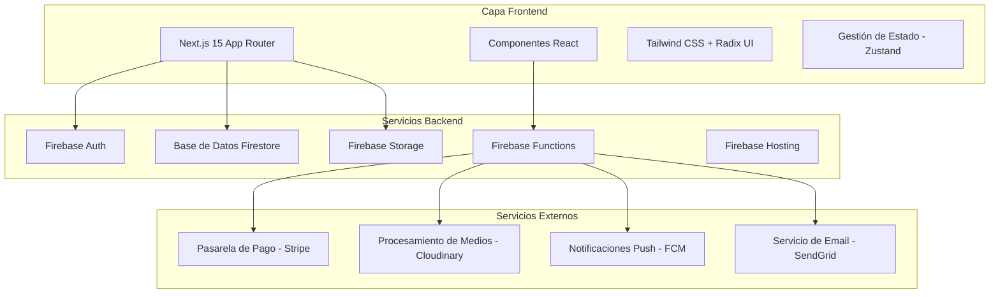

# Documento de Diseño - Plataforma Vasílala

## Resumen General

Vasílala es una plataforma web moderna que combina funcionalidades de redes sociales, streaming musical y gestión de eventos, específicamente diseñada para el ecosistema de música latina. La arquitectura aprovecha Next.js 15 con Firebase como backend, implementando un diseño modular que permite escalabilidad y mantenimiento eficiente.

La plataforma se estructura en módulos principales: Feed (estilo TikTok), TSón (streaming musical), Vasílala (eventos), y perfiles profesionales, todos integrados bajo una experiencia de usuario cohesiva con diseño oscuro y detalles dorados.

## Arquitectura

### Arquitectura de Alto Nivel



### Stack Tecnológico

**Frontend:**
- Next.js 15 con App Router
- React 18 con TypeScript
- Tailwind CSS para estilos
- Radix UI para componentes accesibles
- Zustand para gestión de estado
- React Hook Form + Zod para validación de formularios
- Lucide React para iconos

**Backend:**
- Firebase Authentication (multi-proveedor)
- Firestore para base de datos en tiempo real
- Firebase Storage para archivos multimedia
- Firebase Functions para lógica serverless
- Firebase Cloud Messaging para notificaciones

**Integraciones Externas:**
- Stripe para procesamiento de pagos
- Cloudinary para optimización de medios
- Web Audio API para reproducción musical
- WebRTC para capacidades de streaming en vivo

## Componentes e Interfaces

### Estructura de Componentes Principales

```
src/
├── components/
│   ├── ui/                     # Componentes base Radix UI
│   ├── layout/                 # Navegación, headers, footers
│   ├── feed/                   # Componentes del feed estilo TikTok
│   ├── tson/                   # Componentes de streaming musical
│   ├── vasilala/              # Componentes de gestión de eventos
│   ├── profile/               # Componentes de perfil de usuario
│   ├── studio/                # Herramientas de creación de contenido
│   └── admin/                 # Panel de administración
├── app/
│   ├── (auth)/                # Páginas de autenticación
│   ├── feed/                  # Feed principal
│   ├── tson/                  # Streaming musical
│   ├── vasilala/              # Plataforma de eventos
│   ├── profile/               # Perfiles de usuario
│   ├── studio/                # Creación de contenido
│   └── admin/                 # Panel de administración
├── lib/
│   ├── firebase/              # Configuración de Firebase
│   ├── auth/                  # Utilidades de autenticación
│   ├── db/                    # Operaciones de base de datos
│   ├── storage/               # Utilidades de subida de archivos
│   └── utils/                 # Utilidades generales
└── hooks/                     # Hooks personalizados de React
```

### Definiciones de Interfaces Clave

```typescript
// Tipos de Usuario
interface Usuario {
  id: string;
  email: string;
  nombreUsuario: string;
  nombreMostrar: string;
  avatar?: string;
  tipoUsuario: 'fan' | 'artista' | 'dj' | 'bailarin' | 'escuela' | 'local' | 'organizador';
  verificado: boolean;
  estadoVerificacion: 'pendiente' | 'aprobado' | 'rechazado';
  enlacesSociales?: EnlacesSociales;
  biografia?: string;
  ubicacion?: string;
  fechaCreacion: Date;
  fechaActualizacion: Date;
}

// Tipos de Contenido
interface PublicacionVideo {
  id: string;
  idUsuario: string;
  urlVideo: string;
  urlMiniatura: string;
  descripcion: string;
  idCancionMusical?: string;
  hashtags: string[];
  likes: number;
  comentarios: number;
  compartidos: number;
  visualizaciones: number;
  fechaCreacion: Date;
}

interface CancionMusical {
  id: string;
  idArtista: string;
  titulo: string;
  artista: string;
  album?: string;
  duracion: number;
  urlAudio: string;
  urlPortada?: string;
  genero: string[];
  esOriginal: boolean;
  reproducciones: number;
  fechaCreacion: Date;
}

interface Evento {
  id: string;
  idOrganizador: string;
  titulo: string;
  descripcion: string;
  lugar: string;
  direccion: string;
  fecha: Date;
  precio: number;
  capacidad: number;
  entradasVendidas: number;
  urlImagen?: string;
  generos: string[];
  artistas: string[];
  estado: 'borrador' | 'publicado' | 'agotado' | 'cancelado';
  fechaCreacion: Date;
}
```

## Modelos de Datos

### Estructura de Colecciones Firestore

```
/usuarios/{idUsuario}
  - Datos del perfil de usuario
  - Documentos de verificación (subcolección)
  - Seguidores/Siguiendo (subcolecciones)

/publicaciones/{idPublicacion}
  - Publicaciones de video con metadatos
  - Comentarios (subcolección)
  - Likes (subcolección)

/musica/{idCancion}
  - Metadatos de canciones musicales
  - Historial de reproducciones (subcolección)

/eventos/{idEvento}
  - Información del evento
  - Entradas (subcolección)
  - Asistentes (subcolección)

/listas-reproduccion/{idLista}
  - Listas de reproducción creadas por usuarios
  - Referencias a canciones

/notificaciones/{idUsuario}/notificaciones/{idNotificacion}
  - Notificaciones específicas del usuario

/admin/
  - Solicitudes de verificación
  - Contenido reportado
  - Estadísticas de la plataforma
```

## Manejo de Errores

### Categorías de Errores y Respuestas

**Errores de Autenticación:**
- Credenciales inválidas → Redirección al login con mensaje de error
- Sesión expirada → Renovación automática de token o re-autenticación
- Permisos insuficientes → Error 403 con sugerencia de actualización

**Errores de Subida de Contenido:**
- Tamaño de archivo excedido → Sugerencia de compresión con opción de reintentar
- Formato inválido → Conversión de formato o rechazo con orientación
- Violación de derechos de autor → Bloqueo de contenido con proceso de apelación

**Errores de Procesamiento de Pagos:**
- Pago fallido → Mecanismo de reintento con métodos alternativos
- Fondos insuficientes → Mensaje de error claro con opciones de pago
- Detección de fraude → Proceso de verificación de seguridad

## Estrategia de Testing

### Enfoque de Pirámide de Testing

**Pruebas Unitarias (70%):**
- Renderizado de componentes y props
- Funciones utilitarias
- Hooks personalizados
- Lógica de validación de formularios
- Funciones de consulta de base de datos

**Pruebas de Integración (20%):**
- Flujos de autenticación de usuario
- Procesos de subida de contenido
- Procesamiento de pagos
- Actualizaciones en tiempo real
- Interacciones entre componentes

**Pruebas End-to-End (10%):**
- Jornadas completas de usuario
- Flujos críticos de negocio
- Compatibilidad entre navegadores
- Responsividad móvil

## Consideraciones de Seguridad

### Autenticación y Autorización

```typescript
// Reglas de Seguridad de Firebase
rules_version = '2';
service cloud.firestore {
  match /databases/{database}/documents {
    // Los usuarios solo pueden editar su propio perfil
    match /usuarios/{idUsuario} {
      allow read: if true;
      allow write: if request.auth != null && request.auth.uid == idUsuario;
    }
    
    // Solo artistas verificados pueden subir música
    match /musica/{idCancion} {
      allow read: if true;
      allow create: if request.auth != null 
        && get(/databases/$(database)/documents/usuarios/$(request.auth.uid)).data.tipoUsuario in ['artista', 'dj', 'escuela']
        && get(/databases/$(database)/documents/usuarios/$(request.auth.uid)).data.verificado == true;
    }
    
    // Solo locales verificados pueden crear eventos
    match /eventos/{idEvento} {
      allow read: if true;
      allow create: if request.auth != null 
        && get(/databases/$(database)/documents/usuarios/$(request.auth.uid)).data.tipoUsuario in ['local', 'organizador']
        && get(/databases/$(database)/documents/usuarios/$(request.auth.uid)).data.verificado == true;
    }
  }
}
```

## Optimización de Rendimiento

### Optimizaciones Frontend

**División de Código:**
```typescript
// Carga perezosa para componentes pesados
const PaginaEstudio = lazy(() => import('@/app/studio/page'));
const PanelAdmin = lazy(() => import('@/app/admin/page'));

// División de código basada en rutas con Next.js
export default function Layout({ children }: { children: React.ReactNode }) {
  return (
    <Suspense fallback={<SpinnerCarga />}>
      {children}
    </Suspense>
  );
}
```

**Optimización de Medios:**
- Componente Image de Next.js para optimización automática
- Cloudinary para transformaciones dinámicas de imagen/video
- Carga progresiva para contenido de video
- Formato WebP con fallbacks

Este diseño proporciona una base sólida para implementar la plataforma Vasílala con todas las características requeridas mientras mantiene estándares de escalabilidad, seguridad y rendimiento.